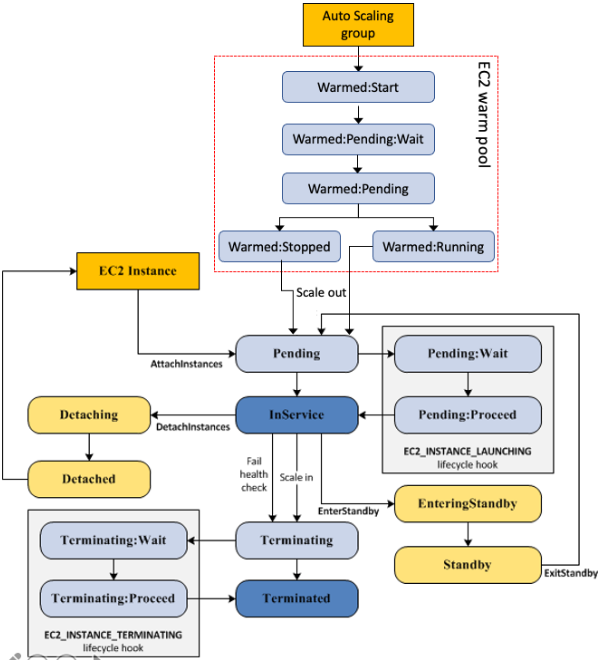
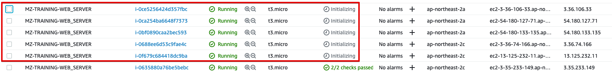
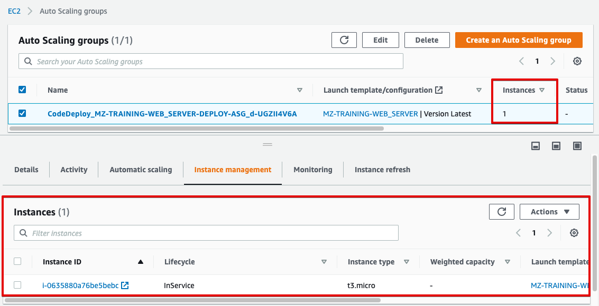
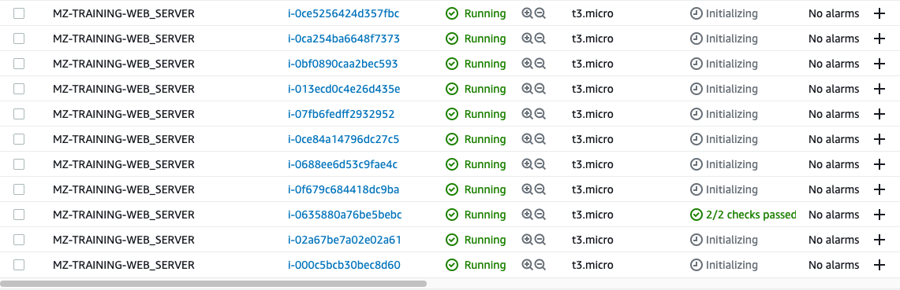
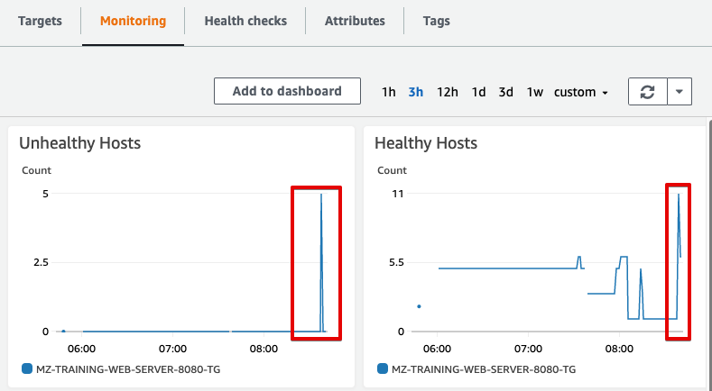
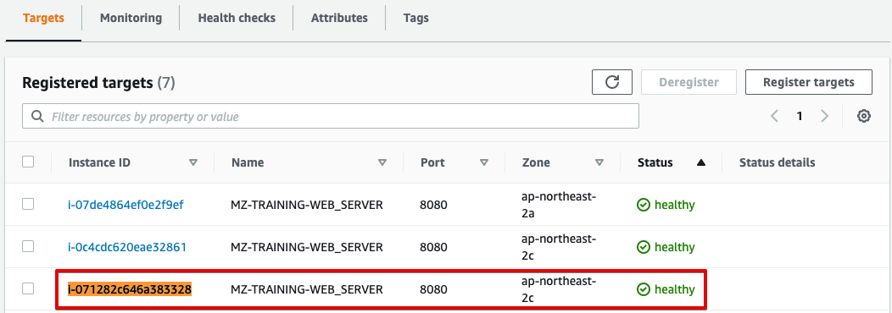
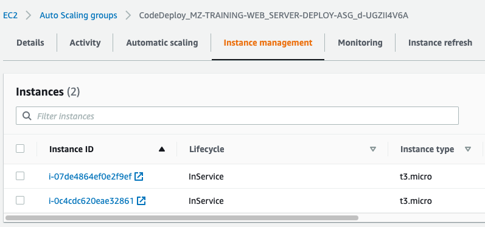

# EC2 Auto Scaling warm pools 소개


**<문서 개정 이력 >**


|버전|발행일|작성자/검토자|비고|
|:--:|:--:|:--:|:--:|
|v0.1|2021.05.28|하수용|초안 작성|

</center>

<br>

[[_TOC_]]

<br>


## 01. Ec2 Auto Scaling warm pool이란?
Amazon EC2 Auto Scaling  웜 풀은 애플리케이션 인스턴스를 사전 초기화하여 애플리케이션을 더 빠르게 확장하고 지속적으로 실행되는 인스턴스 수를 줄여 비용을 절감 할 수 있도록 지원합니다. 

웜 풀을 통해 고객은 애플리케이션 트래픽을 신속하게 처리 할 준비가 된 사전 초기화 된 EC2 인스턴스 풀을 생성하여 애플리케이션의 탄력성을 개선 할 수 있습니다.

기존 warm pool이 적용되지 않은 Auto scale의 수명주기는 아래와 같습니다.


만약 warm pool이 적용되어 있다면, 아래와 같이 수명주기 다이어그램에 변경됩니다. 




보시는 바와 같이 Auto Scaling group에 warm pool이 추가되는 것을 알 수 있습니다.
AutoScaling은 인스턴스의 추가가 발생할 떄 warm pool에서 stopped된 인스턴스 혹은 running되고 있는 인스턴스를 ASG InService로 상태 전환하는 것을 알 수 있습니다. 

## 02. 실습
### 2.1 현재 ASG의 launch 속도 확인 
먼저 기존의 ASG의 신규 인스턴스가 `Launch` 상태부터 `InService` 상태까지 어느정도 시간이 걸리는지 측정을 해보겠씁니다.
이를 위해 `./script/activities_check.sh` 를 실행합니다. 
```bash
 ~/Documents/git/ec2_auto_scaling_warm_pools/ [master] sh ./scripts/activities_check.sh [AutoScale_Name]
Launching a new EC2 instance: i-05b12beb88e43320d Duration: 130s
Launching a new EC2 instance: i-0bccd02583599605a Duration: 130s
Launching a new EC2 instance: i-01576a0f2779fd4c8 Duration: 160s
Launching a new EC2 instance: i-074bda12617aa6e68 Duration: 129s
Launching a new EC2 instance: i-0deb04910a5f0e38f Duration: 155s
Launching a new EC2 instance: i-0e6664a983435d7a8 Duration: 154s
Launching a new EC2 instance: i-00fc0d0d1a9d254ed Duration: 124s
Launching a new EC2 instance: i-0a8c0a0fe18b7c7c1 Duration: 131s
Launching a new EC2 instance: i-0572f006b2a8c5f0b Duration: 161s
......
```

현재 ASG의 activity 로그를 가지고 와서 시간을 소요된 시간을 보여 줍니다. 
새로운 인스턴스가 시작될 때에는 대략 140여초 정도 소요되었네요. 

이번에는 warm pools을 추가하고 비교를 해보겠습니다.
  - AWS CLI 참고 
    - [put-warm-pool](https://awscli.amazonaws.com/v2/documentation/api/latest/reference/autoscaling/put-warm-pool.html) 


```bash
aws autoscaling put-warm-pool \
  --auto-scaling-group-name "AutoSclae_Name" \
  --pool-state Stopped 
```
  - `--pool-state` 매개변수를 `Running`으로 지정하여 인스턴스를 시작상태로 웜풀에 대기시킬 수도 있습니다. 다만 이 경우 비용상의 이점이 없어지며, ASG에서 관리되지 않는 웜풀 내의 인스턴스가 로드밸런서에 서비스에 InService되므로 개인적으로 사용하지 않는것을 권해 드립니다. 
  - 위의 명령어와 같이 `--max-group-prepared-capacity` 옵션을 지정하지 않으면 ASG의 MAX-Desired capcity 값이 자동으로 정의됩니다. 
  - 즉, ASG에 MIN값 1, MAX값 5, Desired값이 1일 때 warm pool의 수량은 MAX-Desired이므로 4가 됩니다.
  - 이렇게 설정을하면 ASG의 MAX 값이 변경될 때마다 동적으로 변경됩니다.
  - 만약 위 명령과 같이 동적으로 warm pool의 크기를 지정하지 않고, 수치를 딱 정하고 싶을 때에는 아래와 같이 `--max-group-prepared-capacity` `--min-size` 옵션을 부여 합니다.  


```bash
aws autoscaling put-warm-pool \
  --auto-scaling-group-name AutoSclae_Name \
  --max-group-prepared-capacity 5 --min-size 5 --pool-state Stopped 
```
  
명령을 수행하면 아래와 같이 인스턴스들이 launching 되었다가 stopped 되는 것을 확인할 수 있습니다. 
  - [주의] ASG의 `Health check grace period` 값에 충분한 값이 없다면, 상태 검증이 안된 웜풀 인스턴스들이 LoadBalancer에 InService 될 수도 있으니 주의합니다. 





이때 ASG의 상태를 보면 warm pool은 ASG에서 관리하는 대상이 아니므로 instances의 갯수는 그대로 1대를 유지하게 됩니다. 





만약 Warm pool의 상태를 확인하고 싶으시다면 아래와 같은 명령을 수행합니다. 
  - AWS CLI 참고 
    - [describe-warm-pool](https://awscli.amazonaws.com/v2/documentation/api/latest/reference/autoscaling/describe-warm-pool.html) 


```bash
aws autoscaling describe-warm-pool \
  --auto-scaling-group-name AutoSclae_Name --output table

||+----------------------------------+---------------------------------------+----------------+||
||                                    WarmPoolConfiguration                                    ||
|+-------------------------------------------------+-------------------+-----------------------+|
||            MaxGroupPreparedCapacity             |      MinSize      |       PoolState       ||
|+-------------------------------------------------+-------------------+-----------------------+|
||  5                                              |  5                |  Stopped              ||
|+-------------------------------------------------+-------------------+-----------------------+|
```


이제 Warm pool의 상태 변화를 확인하기 위해 ASG의 max size 값과 desired를 변경해봅니다. 
  - AWS CLI 참고 
    - [update-auto-scaling-group](https://awscli.amazonaws.com/v2/documentation/api/latest/reference/autoscaling/update-auto-scaling-group.html) 

```bash
aws autoscaling update-auto-scaling-group \
  --auto-scaling-group-name AutoSclae_Name \
  --min-size 1 --max-size 6 --desired-capacity 6
```

warm pool에 속한 5대의 인스턴스가 ASG에 InService되기 위해 running 상태로 변경되고, 
웜풀이 비어있으므로, 다시 채우기 위해 새로운 5대 인스턴스가 running -> stoped로 상태 변경 됩니다. 



ASG 변경 후 launcching 재 확인합니다.
```bash
 ~/Documents/git/ec2_auto_scaling_warm_pools/ [master*] sh ./scripts/activities_check.sh CodeDeploy_MZ-TRAINING-WEB_SERVER-DEPLOY-ASG_d-J2J307R9A
Launching a new EC2 instance from warm pool: i-04b60b6d4c60e9bd1 Duration: 126s
Launching a new EC2 instance from warm pool: i-02cd17757f97f1206 Duration: 96s
Launching a new EC2 instance from warm pool: i-0fe674a2c2e8dd771 Duration: 95s
Launching a new EC2 instance from warm pool: i-04e13b936687c3632 Duration: 72s
Launching a new EC2 instance from warm pool: i-0ad85c4d050aba286 Duration: 69s
```
  - 위에서 확인할 수 있듯이 warm pool에서 시작된 인스턴스가 새롭게 시작된 인스턴스보다 약간 빠른것을 알 수 있습니다.
  - 실제로 테스트해 본 결과 [가이드 문서](https://aws.amazon.com/ko/blogs/compute/scaling-your-applications-faster-with-ec2-auto-scaling-warm-pools/)와 같이 획기적으로 시간이 줄지는 않았습니다.


이제 warm pool 환경을 삭제해 줍니다. 
  - AWS CLI 참고 
    - [delete-warm-pool](https://awscli.amazonaws.com/v2/documentation/api/latest/reference/autoscaling/delete-warm-pool.html) 


```bash
aws autoscaling delete-warm-pool --auto-scaling-group-name AutoSclae_Name --force 
```


## 03. 주의 및 제한사항
### 2.1 Console에서의 설정 지원이 안되며, CLI로만 가능합니다.
아직까지는 콘솔에서 warm pool을 제어하실 수는 없으며, CLI, CDK를 통해서만 지원됩니다. 
그리고, 한번 지정해두면 CodeDeploy를 통해 ASG가 복제되는 상황에서도 설정이 유지되므로 배포 과정에서 매번 설정할 필요는 없습니다. 


### 2.2 ASG에 Spot과 On-demand가 혼합되어 있는 경우 웜풀을 지원하지 않습니다. 
ASG에 Spot와 On-demand가 혼합되어 있는 경우 웜풀을 지원하지 않습니다. 
물론 Spot으로만 Launch template이 설정되어 있다면 이 또한 지원하지 않습니다. 

```bash
An error occurred (ValidationError) when calling the PutWarmPool operation: You can’t add a warm pool to an Auto Scaling group that has a mixed instances policy or a launch template or launch configuration that requests Spot Instances.
```


### 2.3 Warm-pool의 수명주기 중 실행 과정에서 LB에 attach 합니다.





웜풀을 재지정하는 과정에서 TG에 Unhealthy hosts와 Healthy hosts 메트릭이 변경됩니다. 
이는 ASG의 Health check grace period 설정이 EC2 내의 서비스가 올라오기 전 검사를 하기 때문으로 Health check grace period을 적절한 값으로 늘려주어야 합니다. 


### 2.3 Warm-pool을 running으로 설정할 경우 ASG에 적용 받지 않는 서비스 인스턴스가 생성이 됩니다.
Warm pool은 기본적으로 ASG에 적용 받지 않습니다. 
만약 웜풀의 `--state running`으로 설정하였을 경우 ASG에 적용 받지 않은 인스턴스가 생성이 되어 LoadBalancer에 Attach 됩니다. 

웜풀의 상태를 보면 i-071282c646a383328는 Warmed:Running 상태를 가집니다. 
```bash
aws autoscaling describe-warm-pool \
  --auto-scaling-group-name AutoSclae_Name --output text --query "WarmPoolConfiguration.PoolState" --query "Instances[*].{Instance:InstanceId,State:LifecycleState}"
i-071282c646a383328     Warmed:Running
```

하지만, LB의 Target group에 인스턴스가 들어가 있어서 실제로는 서비스 중이며, 





하지만, ASG에는 warm-running 인스턴스는 관리되고 있지 않습니다. 




즉, ASG의 Desired capacity와 TG의 Instnaces 갯수가 가 miss match 됩니다. 


### 2.4 warm-pool이 적용된 상태로 CodeDeploy를 통한 배포를 실행하면 이후 ASG도 동일한 warm-pool 설정을 상속 받습니다.
CodeDeploy를 배포하는 환경에서도 이전의 ASG 속성을 상속 받으므로 문제되지 않습니다. 


### 2.5 만약 Ec2 인스턴스의 볼륨 타입이 io1, io2으로 되어 있다면..? 
warm pool을 통해 stopped 상태의 Ec2라하더라도 EBS volume의 비용을 지출이 되므로 EBS 비용이 과다하게 지출될 수 있습니다. 
이는 io 타입의 볼륨 뿐만이 아니라 대용량 볼륨을 사용할 경우에도 동일한 문제가 발생합니다. 
